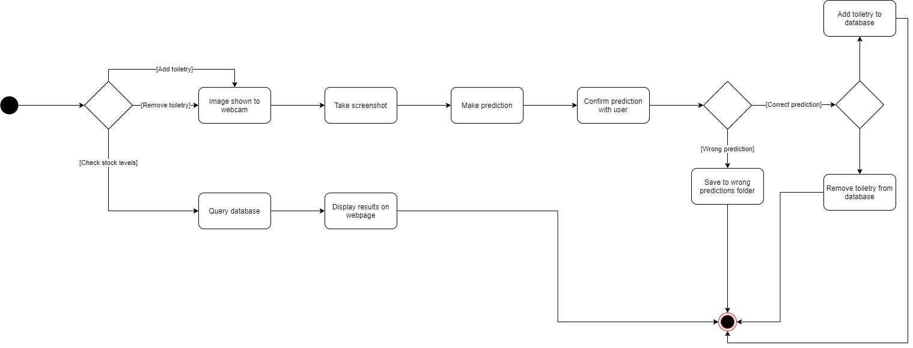

# Stock tracker (Work-in-progress)
This repository contains code used for a personal project to track/monitor the stock of current toiletries.  
The model is trained in Tensorflow (Keras) using self-collected images and deployed as a Flask app.  

** **Notes:** **
* Model file is not included due to Github file size limitation of 100MB (Model is ~104MB)
* Images are not provided to reduce repository size

#  Table of Contents 
[Overview](#overview)  
[Prerequisites](#prequisites)  
[Usage](#usage)  
[TODO](#todo)

#  Overview 
1. The notebook (model.ipynb) contains the code to load the data, run stratified k-fold to select a model architecture, train the model on the full dataset, generate the model metrics and, evaluate the model on the test dataset.
2. Flask app wraps the model and provides backend functions such as making predictions, displaying the webcam images and database queries.
3. Javascript serves as an intermediary between the webpage and backend 
4. A SQLite database is used to store records of the toiletries

#  Prequisites 
* tensorflow    
* matplotlib
* numpy
* pandas
* sklearn
* flask
* cv2
* sqlalchemy

#  TODO 
Current stage of project is a working version with addtional updates planned for improvements
* Add in exception handling and appropriate HTTP status codes/messages
* Add unittests
* Update model to object detection instead of image recognition
* Clean up code base